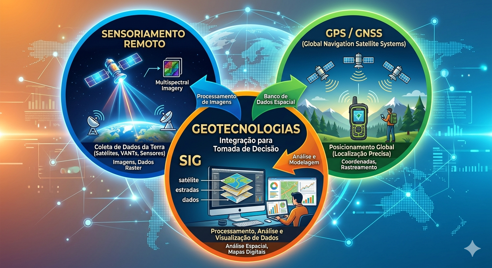

::: {#cap1 .section}
# Introdução e Conceitos Básicos

Este primeiro capítulo tem como objetivo apresentar os conceitos
fundamentais que formam a base do geoprocessamento. Antes de mergulhar
nas ferramentas e práticas aplicadas, é essencial compreender as ideias
que sustentam o uso de dados geográficos, a integração entre diferentes
tecnologias e o papel dos Sistemas de Informações Geográficas (SIG) no
apoio à tomada de decisão em diversas áreas como agricultura, meio
ambiente, urbanismo e gestão territorial.

::: {.callout-note}
\[IMAGEM 1: Ilustração conceitual mostrando o globo terrestre com
camadas temáticas sobrepostas (relevo, vegetação, uso do solo). A imagem
deve representar a ideia de "camadas de informação geográfica"
integradas em um único sistema.\]
:::
:::

::: {#geotecnologias .section}
## Geotecnologias

O termo **geotecnologias** agrupa o conjunto de tecnologias voltadas
para a coleta, processamento, análise e apresentação de informações
geográficas. São ferramentas indispensáveis para analisar o espaço e
compreender padrões e relações em fenômenos naturais e humanos.
[@web70]

As principais geotecnologias incluem:

-   **Sensoriamento Remoto**: uso de satélites e drones para captar
    imagens e dados da superfície terrestre.
-   **Sistemas de Posicionamento Global (GPS/GNSS)**: determinação
    precisa de coordenadas geográficas.
-   **Sistemas de Informações Geográficas (SIG)**: integração,
    manipulação e análise de dados espaciais em ambiente computacional.
-   **Cartografia Digital**: representação visual das informações
    espaciais em mapas digitais.

Em conjunto, essas tecnologias permitem criar diagnósticos territoriais,
planejar intervenções e monitorar transformações ambientais e urbanas.
[@web70]

::: {.callout-note}
\[IMAGEM 2: Diagrama mostrando a integração entre Sensoriamento Remoto,
GPS e SIG formando o conjunto de "Geotecnologias". A imagem pode exibir
três círculos interligados com ícones representando satélites,
receptores GNSS e computadores com mapas.\]
:::

:::

::: {#geoprocessamento .section}
## Geoprocessamento

O **geoprocessamento** é o conjunto de técnicas e métodos computacionais
usados para manipular e analisar informações geográficas. Ele combina
dados espaciais (como mapas, imagens de satélite, pontos de GPS) e dados
descritivos (como tabelas com atributos sobre o território) para gerar
novos conhecimentos. [@web70]

Com o geoprocessamento, é possível responder perguntas como:

-   Onde estão localizadas as áreas de maior declividade?
-   Quais propriedades rurais estão dentro de uma Área de Preservação
    Permanente (APP)?
-   Como o uso do solo mudou nos últimos 10 anos?

O geoprocessamento é amplamente aplicado em estudos ambientais,
planejamento rural, zoneamento urbano, gestão de recursos hídricos e
inúmeras outras áreas que envolvem o espaço geográfico. [@web70]

::: {.callout-note}
\[IMAGEM 3: Exemplo ilustrativo de um mapa temático gerado por
geoprocessamento, com diferentes cores representando tipos de vegetação,
áreas urbanas e hidrografia. A legenda à direita ajuda o leitor a
entender a simbologia utilizada.\]
:::
:::

::: {#sig .section}
## Sistema de Informações Geográficas (SIG)

O **Sistema de Informações Geográficas (SIG)** é o principal ambiente de
operação das geotecnologias. Trata-se de um conjunto integrado de
software, hardware, dados e pessoas voltado à coleta, armazenamento,
análise e exibição de informações espaciais. \[web:8\]

Um SIG permite visualizar o território em forma de camadas, onde cada
camada representa um tema (por exemplo: relevo, uso do solo, rede
hidrográfica, limites de propriedades). A combinação dessas camadas
possibilita realizar análises complexas e gerar mapas temáticos de
grande valor informativo. [@web70]

Exemplos de softwares SIG populares incluem **QGIS** (gratuito e de
código aberto) e **ArcGIS** (comercial). No ambiente SIG, o usuário
pode:

-   Importar e visualizar dados vetoriais e raster;
-   Executar análises espaciais (proximidade, sobreposição, buffer,
    entre outras);
-   Gerar mapas temáticos e relatórios cartográficos;
-   Integrar dados de GPS e imagens de satélite de forma prática.

::: {.callout-note}
\[IMAGEM 4: Captura de tela (ou ilustração simulada) de um software SIG
(ex: QGIS) mostrando várias camadas sobrepostas -- base de satélite,
vetores de rios, limites e áreas agrícolas -- e uma janela de atributos
aberta.\]
:::

::: {.callout-warning}

*Material didático elaborado para introdução à área de Geoprocessamento.
Este conteúdo pode ser usado como referência em cursos técnicos e de
capacitação.*
:::

