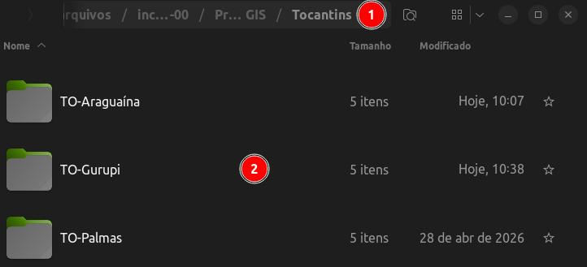
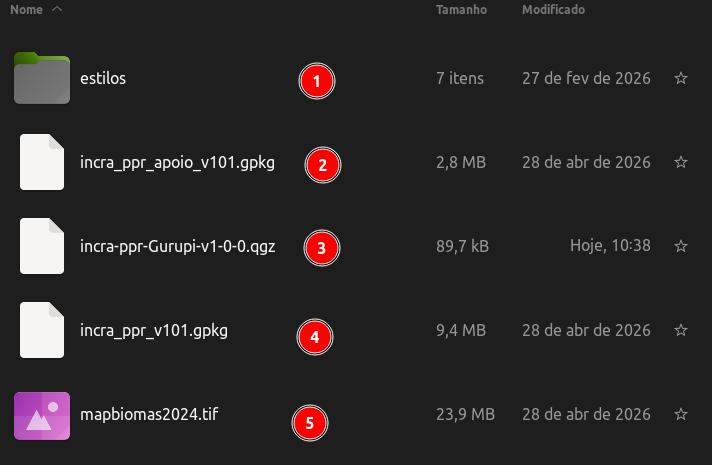
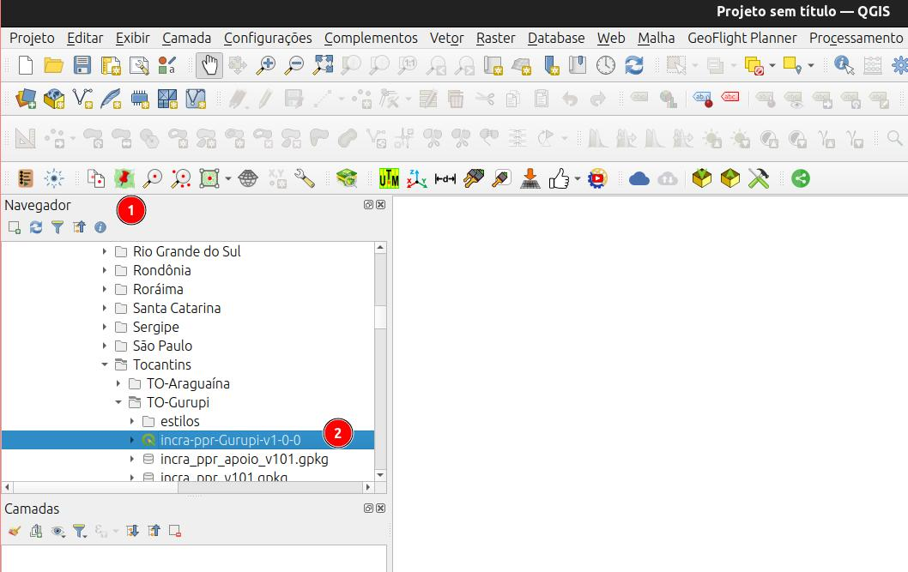
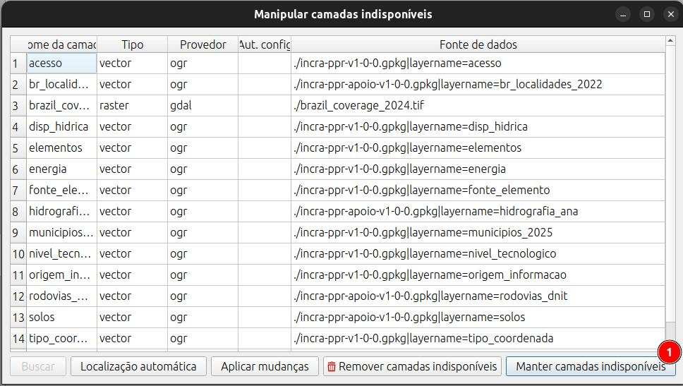
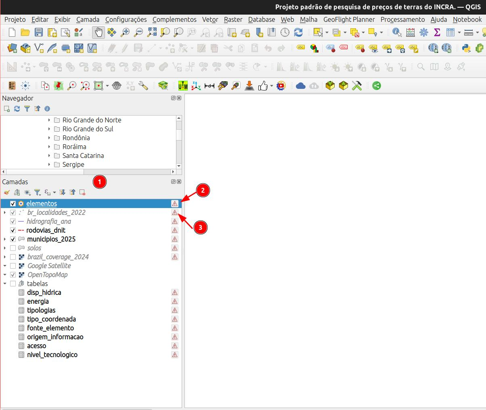
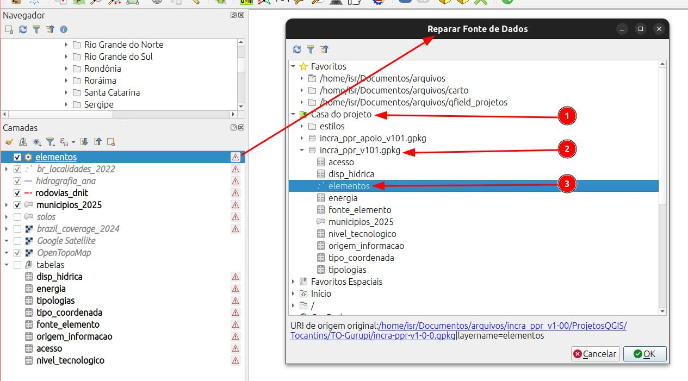
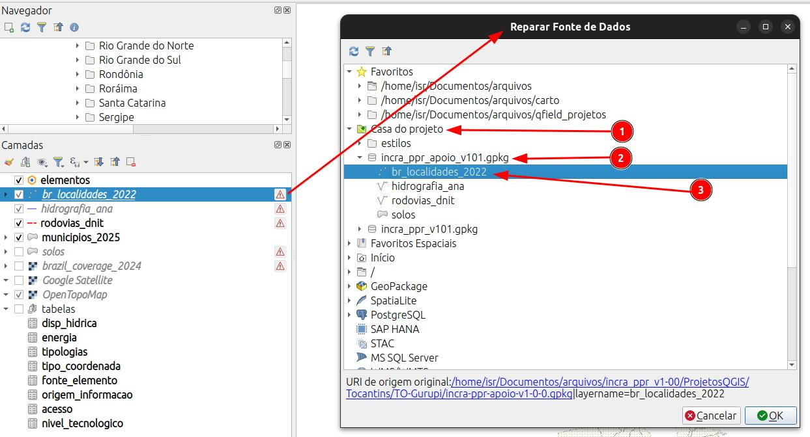
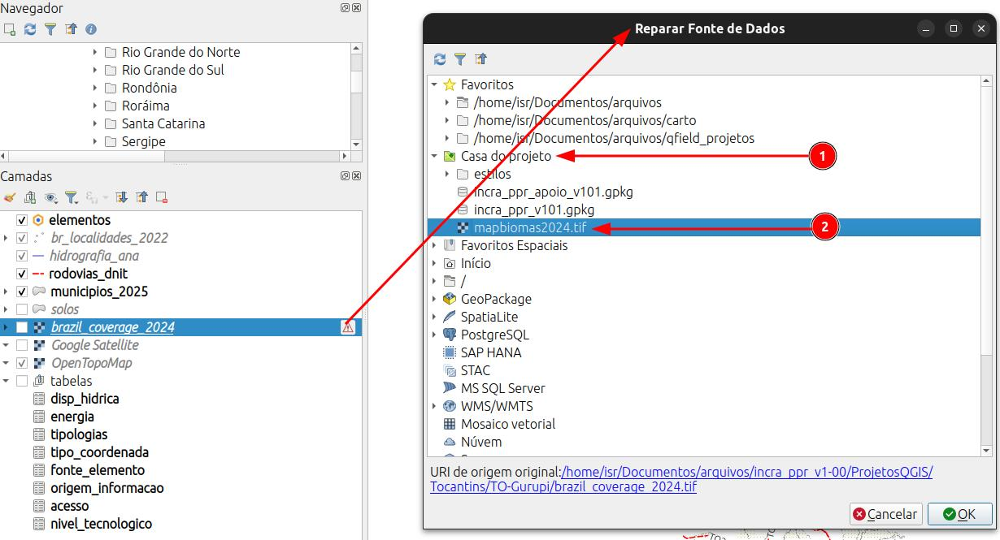
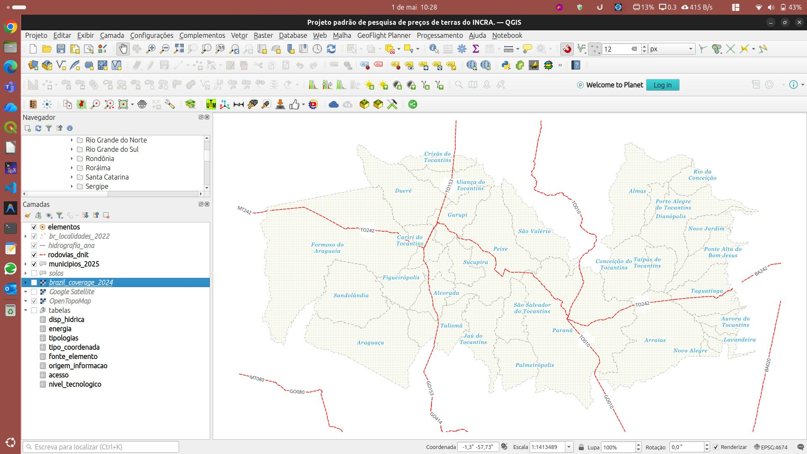

::: {#cap10-1 .section}
# QField: Projeto de coleta de preços de imóveis rurais.

::: {#introducao-qfield .section}
## Introdução

Foi disponibilizado um projeto padrão para coleta de preços de imóveis rurais destinados a elaboração de estudos de mercados de terras e avaliação de imoveis rurais. O formulário de coleta está baseado no manual de obtenção do INCRA e na Instruções normativa que regula a elaboração dos estudos de mercado de terras.

O projeto, copatível com o QFIELD e com o QGIS(3.x) sendo coposto dos seguindo componentes:

::: {.callout-note}
1. pasta do estado contendo todos os projetos daquela unidade da federação;
2. pasta das regiões intermediárias do estado.
:::

Cada pasta é composta dos seguintes arquivos:

::: {.callout-note}
1. `pasta` com os estilos (formatação) do projeto (cores, textos, etc)
2. `ìncra_ppr_apoio_v101.gpkg`: arquivo GeoPackage com as camadas vetoriais de apoio (solos, hidrografia, localidades, etc);
3. `incra-ppr-Gurupi-v1-0-0.qgz`: arquivo de projeto do QGIS com as configurações gerais e formatação dos formulários;
4. `ppr_apoio_v101.qgz`: arquivo GeoPackage com as camadas vetoriais principais da coleta (elementos e tabelas); 
5. `mapbiomas2024.tif`: arquivos raster com o uso do solo (MapBiomas 2024) para auxiliar na coleta de informações sobre o uso do solo.
:::
:::

::: {#qfield-abrindo .section}
## Abrindo o projeto no QGIS

Antes de inciar o trabalho de campo devemos abrir o projeto no QGIS para verificar a ocorrencia de erros ou adicionar mas camadas que irão auxiliar na coleta dos dados, tais quais, imóveis certificados, CAR, etc.

Utilizando o [`Painel do Navegador`](https://docs.qgis.org/3.44/pt_BR/docs/user_manual/introduction/browser.html#the-browser-panel) (janela do QGIS que mostra a árvores de diretórios e arquivos do seu sistema operacional), navegue até o local onde salvou os projetos do seu estado e carregue o arquivo do projeto com um duplo clique.

::: {.callout-note}
1. Painel do navegador.
2. projeto do QGIS dentro da pasta do projeto.
:::
:::

::: {#qfield-erro-caminho .section}
## Erro de caminho nas camadas

Para o caso de aparecer uma mensagem de erro de caminho das camadas do projeto, proceder conforme abaixo descrito. Esse erro decorre da modificação do projetos entre computadores e pastas distintsa, porém é facilmente resolvido.

::: {.callout-note}
1. Clique no botão, Manter camadas indisponíveis.
:::

O projeto será aberto com as camadas originais com um símbolo no lado direito.

::: {.callout-note}
1. [`painel de camadas`](https://docs.qgis.org/3.44/pt_BR/docs/user_manual/introduction/general_tools.html#layers-panel).
2. Símbolo de erro de caminho da camada `elementos`.
3. Símbolo de erro de caminho da camada `bf_localidades_2022`.
:::
:::

::: {#qfield-corrigir-caminho .section}
## Corrigindo os caminho do projeto.

Para corrigir os caminho das camadas, clique sobre o símbolo que aparece ao lado direito de cada uma. Na janela que aparecer, devemos apontar para o local correto onde cada camada foi salva.

::: {.callout-note}
1. [`Casa do Projeto`](https://docs.qgis.org/3.44/pt_BR/docs/user_manual/introduction/browser.html#project-home): local que aponta para a pasta onde o projeto está salvo.
2. `incra_ppr_v101.gpkg`: local onde a camada está salva.
3. `elementos`: camada a ser corrigida. As demais camadas que estão no mesmo arquivo GeoPackage serão corrigidas automaticamente.
:::

::: {.callout-note}
1. [`Casa do Projeto`](https://docs.qgis.org/3.44/pt_BR/docs/user_manual/introduction/browser.html#project-home): local que aponta para a pasta onde o projeto está salvo.
2. `incra_ppr_apoio_v101.gpkg`: local onde a camada está salva.
3. `br_localidades_2022`: camada a ser corrigida. As demais camadas que estão no mesmo arquivo GeoPackage serão corrigidas automaticamente.
:::

::: {.callout-note}
1. [`Casa do Projeto`](https://docs.qgis.org/3.44/pt_BR/docs/user_manual/introduction/browser.html#project-home): local que aponta para a pasta onde o projeto está salvo.
2. `mapbiomas2024.tif`: camada a ser corrigida.
:::

Concluíndo-se as etapas de correção dos caminhos, o projeto estará pronto para ser utilizado no QGIS e posteriormente exportado para o QFIELD.

:::
:::
