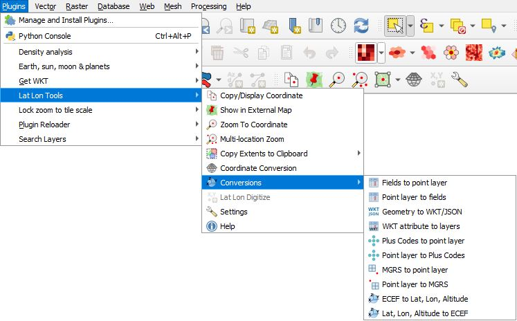
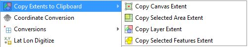
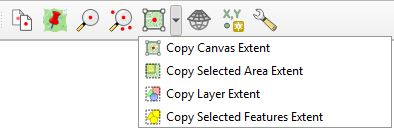
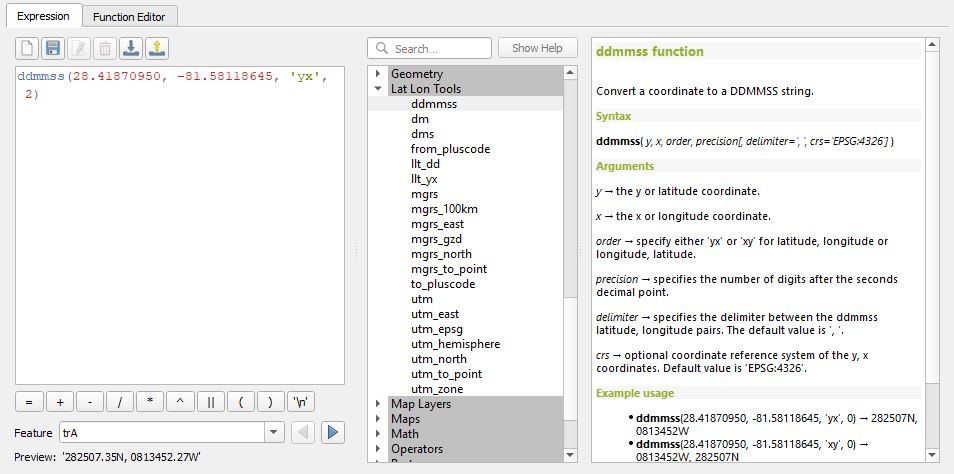
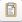
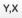
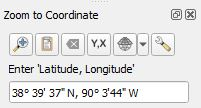

::: {#cap11b .section}
# QGIS: Coleta de preços no software QGIS.

::: {#introducao .section}
## Introdução
O projeto de coleta traz as informações básicas para coletas de preços de imóveis rurais através da camada `elementos`, sendo uma feição de pontos com o formulário de atributos configurado com as informações necessárias para uso em procedimentos de avaliação de imóveis rurais e planilhas de preços referenciais de regiões do país.  
:::

::: {#preços .section}
## Camada de `elementos`

## Informar coordenada de localização de elementos de preços

### Editando a localização de um ponto da camada `elementos`

### Usando o plugin [`Lat Lon Tools`](https://github.com/hamiltoncj/qgis-latlontools-plugin/#readme)

O ***Lat Lon Tools*** facilita a captura, o zoom para coordenadas, a conversão de coordenadas em campos de texto para novas camadas de pontos, a exportação da geometria de pontos para campos de texto e a interação com outras ferramentas de mapeamento online. Ele adiciona suporte a coordenadas MGRS, UTM padrão, UPS, Geohash, GEOREF, Plus Code (Open Location Code), WKT, EWKT, JSON e ECEF ao QGIS. Ao trabalhar com o **Google Earth**, **Google Maps** ou outras ferramentas de mapeamento online, as coordenadas são especificadas na ordem 'Latitude, Longitude'. Por padrão, o ***Lat Lon Tools*** usa o formato padrão do Google Maps, mas é muito flexível e pode usar praticamente qualquer projeção e formato de coordenadas para entrada e saída. As seguintes ferramentas estão disponíveis no ***Lat Lon Tools***.

Aqui estão os itens expandidos do menu ***Copiar extensão para a área de transferência***.

Algumas funções podem ser acessadas na barra de ferramentas ***Ferramentas de Latitude e Longitude***. Se, por algum motivo, a barra de ferramentas estiver ausente, selecione o item de menu ***Exibir -> Barras de Ferramentas*** e certifique-se de que a ***Barra de Ferramentas de Latitude e Longitude*** esteja habilitada. Os algoritmos de conversão podem ser executados na Caixa de Ferramentas de Processamento do QGIS.

Diversas conversões podem ser acessadas como funções da calculadora de campo. Na ***Calculadora de Campo***, encontre e expanda o menu ***Ferramentas de Latitude e Longitude***. Clicar em cada entrada exibirá uma descrição da função com exemplos de uso.

*  ***Copiar/Exibir Coordenada*** - Esta opção captura as coordenadas para a área de transferência quando o usuário clica no mapa, usando o formato padrão do Google Maps ou um formato especificado em ***Configurações***. Se o usuário especificar um separador de **Tabulação**, a coordenada poderá ser colada em uma planilha em colunas separadas. Enquanto esta ferramenta estiver selecionada, a coordenada sobre a qual o cursor está posicionado é exibida no canto inferior esquerdo em **graus decimais**, **DMS**, **Graus e Minutos**, **MGRS**, **UTM padrão**, **UPS**, **GEOREF**, **Códigos Plus (Código de Localização Aberto)**, **Geohash**, **H3** (se a biblioteca H3 versão 4.xx estiver instalada), **Localizador de Grade Maidenhead**, **PONTO WKT** ou **GeoJSON**, dependendo das **Configurações**. Por padrão, o sistema utiliza a latitude e longitude geográficas para capturar a coordenada, mas isso pode ser configurado em **Configurações** para usar o SRC do projeto ou qualquer outra projeção desejada. Consulte a seção **Configurações** para obter mais detalhes sobre todas as possibilidades. Um prefixo ou sufixo adicional pode ser adicionado à coordenada e é configurado em **Configurações**. Se o recurso de captura automática estiver habilitado no menu ***Projeto->Opções de Captura Automática...*** do QGIS, a opção *Copiar/Exibir Coordenada* se ajustará a quaisquer vértices vetoriais próximos, de acordo com os parâmetros definidos nas opções de captura automática.
  
*  ***Mostrar em Mapa Externo*** - Com esta ferramenta, o usuário pode clicar no mapa do QGIS, o que abre um navegador externo e exibe a localização em um mapa externo. Os botões esquerdo e direito do mouse podem ser configurados para exibir mapas diferentes. Atualmente, OpenStreetMap, Google Maps, Google Earth Web, MapQuest, Mapillary, OpenStreetMap iD Editor e Bing Maps são suportados, juntamente com o Google Earth, se instalado no sistema. O mapa desejado para exibição pode ser configurado em ***Configurações***, juntamente com serviços de mapa adicionais adicionados pelo usuário. Um marcador temporário pode ser exibido no mapa no local clicado. Para ativar essa função, acesse **Configurações**. Se o recurso de alinhamento estiver ativado, o local clicado se alinhará a quaisquer vértices vetoriais próximos, de acordo com os parâmetros definidos nas opções de alinhamento.

*  ***Zoom para Coordenada*** - Com esta ferramenta, digite ou cole uma coordenada na área de texto e pressione **Enter**. O QGIS centraliza o mapa na coordenada, destaca e cria um marcador temporário no local. Para formatos que representam uma região em vez de um ponto, como **Geohash**, **H3**, **Maindenhead** e **Códigos Plus (Open Location Code)**, a área da região é exibida juntamente com o ponto central. Se o sistema de coordenadas padrão **WGS 84** (EPSG:4326 - latitude/longitude) for especificado, ***Zoom para Coordenada*** pode interpretar coordenadas em **graus decimais**, **DMS**, **WKT POINT**, **UTM padrão**, **UPS**, **MGRS**, **GEOREF**, **Códigos Plus (Open Location Code)** ou **GeoJSON**. Também é possível ampliar para coordenadas **Geohash**, coordenadas de grade **Maidenhead** de rádio amador, coordenadas **H3** Geohash (se a biblioteca H3 versão 4.xx estiver instalada) ou qualquer outra projeção, quando configurada em **Configurações** ou pelo botão **Selecionar Modo CRS**. A ***Ordem das Coordenadas*** em ***Configurações*** ou o botão **Alternar Ordem das Coordenadas** abaixo define se a ordem é latitude seguida de longitude (Y,X) ou longitude seguida de latitude (X,Y). As seguintes ações também podem ser realizadas na caixa de diálogo ***Ampliar para***:
    *  Ao pressionar este botão, o QGIS amplia a visualização para o local.
    *  Isso cola o conteúdo da área de transferência na área de texto.
    *  O marcador é removido com este botão.
    *  Isso alterna a ordem das coordenadas sem precisar acessar as **Configurações**.
    *  Isso especifica o tipo de coordenada que deve ser interpretada sem precisar acessar as **Configurações**.
    *  O comportamento e os tipos de coordenadas interpretados podem ser configurados pressionando o botão **Configurações**.  

    
::: {.callout-important}
As explicações acima foram traduzidas da página do desenvolvedor do plugin [Lat Lon Tools](https://github.com/hamiltoncj/qgis-latlontools-plugin/tree/main) o [Sr. Calvin Hamilton](https://github.com/hamiltoncj)
:::

:::