::: {#cap11b .section}
# QGIS: Coleta de preços no software QGIS.

::: {#introducao .section}
## Introdução
O projeto de coleta traz as informações básicas para coletas de preços de imóveis rurais através da camada `elementos`, sendo uma feição de pontos com o formulário de atributos configurado com as informações necessárias para uso em procedimentos de avaliação de imóveis rurais e planilhas de preços referenciais de regiões do país.  
:::

::: {#preços .section}
## Camada de `elementos`

Vamos coletar um ponto que representa um elementos de preços de terras e preencher o formulário de atributos.

### Colocando em modo de edição.

::: {layout-ncol="2"}

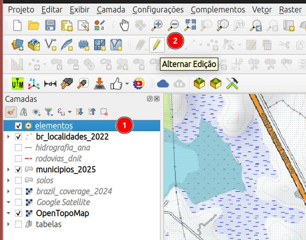

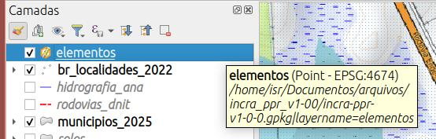{#fig-elementos-em-edição}

:::

::: {.callout-note}

1. Selecione a camada `elementos`;
2. e clique no botão **Alternar Edição** para habilitar a edição da camada;
:::

Verifique que aparecerá um lápis sobre o símbolo da camada, indicando que a mesma está em modo de edição, @fig-elementos-em-edição. 

### Criando um novo ponto.

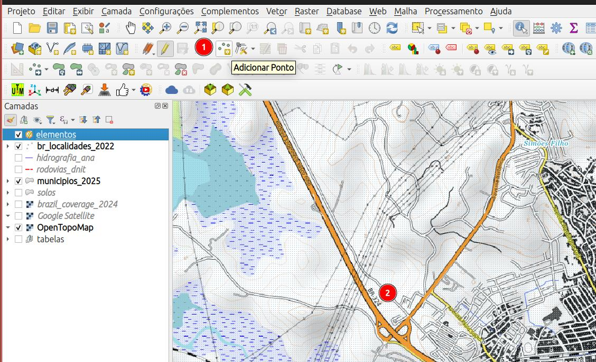

::: {.callout-note}

1. Com a feição `elementos` selecionada na aba de camadas, clique no botão **Adicionar Feição** para criar um novo ponto;
2. navegue no mapa até o local e clique para criar um ponto, logo em seguida, o formulário de atributos será aberto.
:::

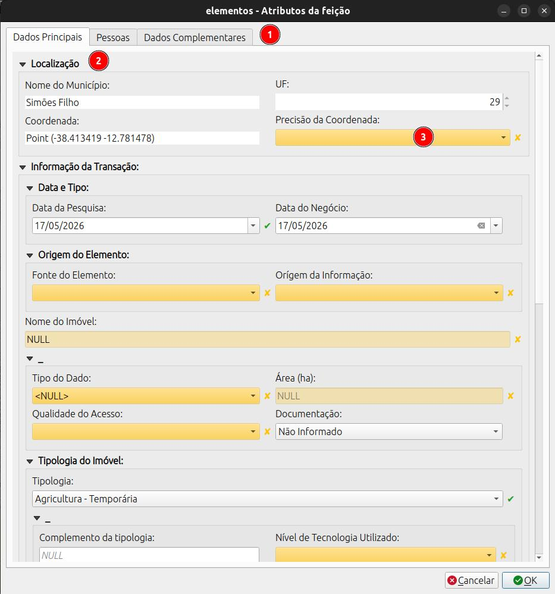

O formulário está dividido em abas, seções e campos.

::: {.callout-note}

1. Abas de seção do formulário;
2. Seção do formulário;
3. Campos do formulário. (*campos em amarelo são de preenchimento obrigatório, devem ser preenchidos antes do envio dos dados*).
:::

### Aba: Dados Principais

**Localização**

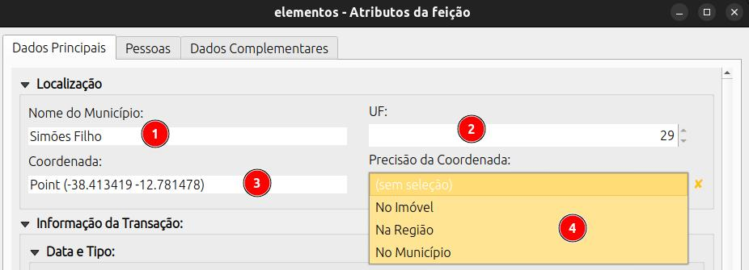

::: {.callout-note}

1. *Nome do Município*: preenchimento automático;
2. *UF*: preenchimento automático;
3. *Coordenada*: preenchimento automático;
4. *Precisão da Coordenada*: Selecione uma das opções, se a coordenada marcada está:
   1. `No imóvel` -> dentro do imóvel;
   2. `Na Região` -> localização aproximada, mas dentro da região de localização do imóvel;
   3. `No município` -> localização apenas do muniípio onde o imóvel está localizado podendo-se utilizar a sede ou o centróide do município;

:::

**Informação da Transação**

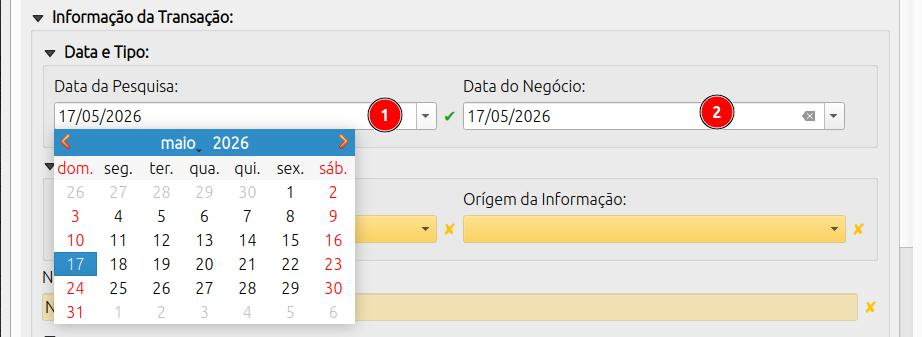{#fig-datas}

::: {.callout-note title=@fig-datas}

1. *Data da Pesquisa*: preenchido automaticamente com a data do dia, mas pode ser editado;
2. *Data do Negócio*: data na qual o elemento foi transacionado. Para ofertas, preencher com a data da aquisição da oferta.
:::

**Orígem do elemento**

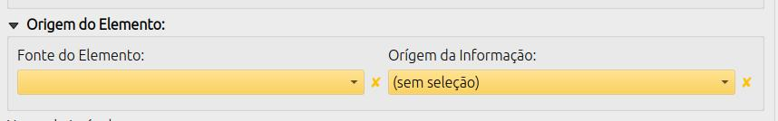

::: {layout-ncol="2"}

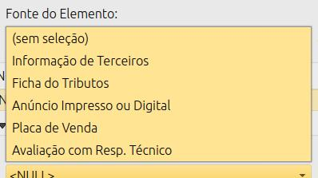{#fig-origem-fonte}

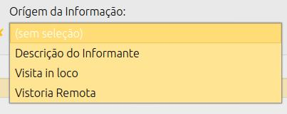{#fig-origem-informacao}  
::: 

::: {layout-ncol="2"}

::: {.callout-note title=@fig-origem-fonte}

Indica a orígem do elementos pesquisado, ou seja, a fonte de onde a informação foi coletada. 
:::

::: {.callout-note title=@fig-origem-informacao}

Indica a orígem da inforação dos atributos. 
:::

:::

**Nome do Imóvel**

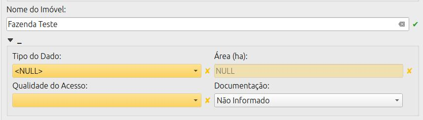

*Nome do Imóvel*: digite um nome para o elemento;

::: {layout-ncol="2"}

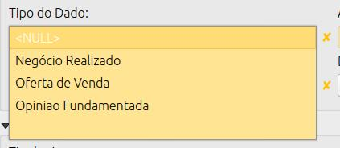{#fig-tipo-dado}

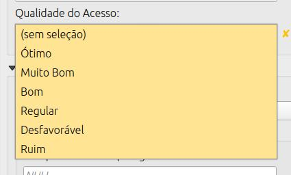{#fig-qualidade-acesso}

::: {.callout-note title=@fig-tipo-dado}

*Negócio Relizado*: indica que o elemento é um negócio já realizado, ou seja, um imóvel que já foi transacionado.
*Oferta de venda*: indica que o elemento é uma oferta, ou seja, um imóvel que está disponível para transação;
*Opinião Fundamentada*: tipo de elemento citado na [NE 112 INCRA](https://www.gov.br/incra/pt-br/centrais-de-conteudos/legislacao/ne_112_2014.pdf){target="_blank"} mas ainda não implementado;
:::

::: {.callout-note title=@fig-qualidade-acesso}

- *Negócio Relizado*: indica que o elemento é um negócio já realizado, ou seja, um imóvel que já foi transacionado;  
- *Oferta de venda*: indica que o elemento é uma oferta, ou seja, um imóvel que está disponível para transação;  
- *Opinião Fundamentada*: tipo de elemento citado na [NE 112 INCRA](https://www.gov.br/incra/pt-br/centrais-de-conteudos/legislacao/ne_112_2014.pdf){target="_blank"} mas ainda não implementado;  
:::

:::

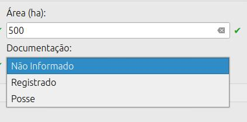{#fig-area-situacao-juridica}

::: {.callout-note title=@fig-area-situacao-juridica}

*Área (ha)*: informe a área do imóvel em hectares;  
*Documentação*: informe se o elementos está registrado ou é uma posse, caso não disponha da informação, selecione a opção `Não Informado`.  

:::

**Tipologias do Imóvel**

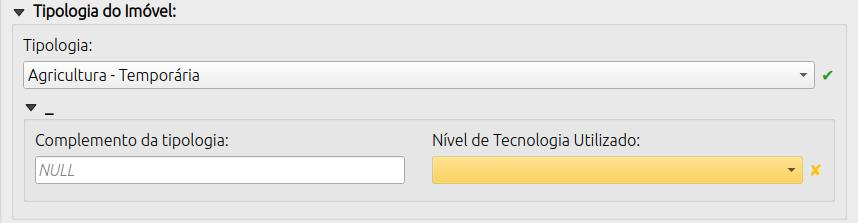

::: {.callout-tip title="Agricultura"}

Este nível categórico compreende o cultivo de plantas de ciclo vegetativo de curta duração e de plantas perenes.

Tipologia | Descrição
--- | ---
Agricultura - Temporaria|Engloba todos os plantios de ciclo curto classificados como temporário, exceto olerícolas
Agricultura - Perene|Engloba todos os plantios de ciclo longo classificados como permanente e semi-perene (cana). Exemplo: Fruticultura.
Agricultura - Olerícola|Engloba todos os plantios de ciclo curto classificados como olerícolas.
Agricultura - Diversos |Engloba todos os plantios não enquadrados nos itens anteriores ou agricultura com alta diversidade de espécies de ciclo curto e longo de relevância econômica.

:::

::: {.callout-tip title="Exploração Mista"}

Este nível categórico compreende os imóveis nos quais ocorrem ao longo do ciclo de produção diferentes sistemas de cultivo e/ou de criação conduzidos de forma isolada, bem como interagindo espacialmente (sucessão e integração) e que possuem retorno econômico relevante como atividade produtiva . Os casos de sistemas mistos nos quais a atividade agrícola seja destinada à alimentação animal são caracterizados como pecuária. Imóveis com atividades produtivas diversas nos quais somente a atividade principal possui relevância econômica significativa não devem ser enquadrados nesta tipologia. Nesta tipologia enquadram se as atividade diversas familiares de criação e cultivo para alimentação familiar podendo haver  ou não a venda da pouca produção excedente.

Tipologia | Descrição
--- | ---
Exploração Mista - Agricultura + Pecuária|Exploração em projetos de integração lavoura pecuária, exploração na qual as atividades econômicas principais são a agricultura e pecuária. A definição da atividade de maior relevância do imóvel  trocando a ordem das atividades de exploração mista  não deve ser feita. Ex.: Se pecuária tem maior relevância econômica que agricultura, o nome da tipologia não deve ser alterada para Exploração Mista - Pecuária + Agricultura.
Exploração Mista - Diversos|Quando o imóvel possuir mais de 2 atividades econômicas principais que não permitem classificar em “Exploração Mista - Agricultura + Pecuária” e nem em “Exploração Mista - Sistemas Agroflorestais (SAFs)”.
Exploração Mista - Sistemas Agroflorestais (SAFs) + Pecuária|Exploração que integra árvores nativas e/ou exóticas com cultivos agrícolas, ou criações de animais na mesma área simulando processos naturais de uma floresta.
Exploração Mista - Subsistência|Exploração em sistemas de baixa a média tecnologia visando a alimentação familiar e produção de pouco excedente.

:::

::: {.callout-tip title="Pecuária"}

Este nível categórico compreende a criação e a produção animais em sistemas extensivos, semi-intensivos e intensivos.

Tipologia | Descrição
--- | ---
Pecuária Baixa Tecnologia|baixo nível tecnológico - criação extensiva sem emprego de manejo, adubação, reserva estratégica ou qualquer método para melhoria da produção.
Pecuária Média Tecnologia|médio nível tecnológico - criação extensiva com emprego de manejo mínimo, adubação esporádica, e reserva estratégica para melhoria da produção.
Pecuária Alta Tecnologia|alto nível tecnológico - criação intensiva com emprego de manejo  alimentar e sanitário, adubação  e melhoria das pastagens, e reserva estratégica como feno ou silagem  e controle do rebanho com anotação de índices zootécnicos.
Pecuária - Suínos/Aves (granjeiros)|Pecuária desenvolvida em estruturas de granjas focado na produção animal.
Pecuária - Aquicultura|Pecuária baseada em aquicultura, geralmente peixes e crustáceos, em sistema similar ao de granjas.
Pecuária - Diversos |Criação de animais não enquadrados nos itens anteriores. Ex.: Agricultura Familiar

:::

::: {.callout-tip title="Florestamento"}

Este nível categórico compreende o cultivo de Floretas Plantadas em áreas com restrição para agricultura.

Tipologia | Descrição
--- | ---
Florestamento - Monocultivo|Florestamento de monocultivos como eucalipto, seringueira, etc.
Florestamento - Outros|Cultivos de floresta plantada não contemplado na opção anterior.

:::

::: {.callout-tip title="Conservação Ambiental"}

Imóvel constituído de floresta primária ou secundária que não apresenta resultado econômico resultante de exploração agrícola, pecuária e florestal (silvicultura), com potencial para ser utilizados como ativo ambiental com finalidades de preservação da fauna e da flora, regularização ambiental de outras propriedades, crédito de carbono e ecoturismo. Áreas consideradas como classe de Capacidade de Uso nível VIII. ATENÇÃO: Áreas com vegetação nativa com ou sem restrição ambiental que possuem aptidão para exploração econômica e valores de mercado próximos a de áreas de produção não se encaixam nesta tipologia.

Tipologia | Descrição
--- | ---
Conservação Ambiental - Servidão Ambiental|Floresta primária - sendo uma remanescente das florestas originais de uma região. Floresta não alterada pela ação do homem. Floresta secundária - em processo de regeneração natural após ter sofrido derrubada ou alteração pela ação do homem ou de fatores naturais, tais como ciclones, incêndios, erupções vulcânicas. Vegetação com restrição ambiental, passível ou não de Autorização de Supressão de Vegetação – ASV cuja a aptidão principar é a consevação ambiental.
Conservação Ambiental - Extrativismo|Florestas nativas, manejadas ou não, que possuem atividade extrativista de produtos de valor comercial tais como: dendê, babaçú, etc. O manejo florestal está incluído nesta tipologia.

:::

::: {.callout-tip title="Não Rural"}

Este nível categórico compreende os imóveis que encontram-se em fase de transição de uma destinação agropecuária e/ou de produção florestal para a implantação de empreendimentos como: energia (parques éolicos, e fotovoltaicos), mineração, agroindústria, turismo, urbanização e recreação (loteamentos em zonas de expansão da área municipal e/ou loteamentos de chácaras de lazer). Na maioria das vezes os valores desta tipologia superam consideravelmenteo o uso econômico para fins agropecuários.

Tipologia | Descrição
--- | ---
Não Rural – Urbanização, Recreativo ou Turístico|Imóveis destinados para moradia (loteamentos), recreação ou turismo.
Não Rural - Agroindustria, Energia ou Mineração|Imóveis cujo o uso destinado seja para empreendimentos de agroindústria, produção de energia ou para mineração.
Não Rural - Outros|Qualquer outro uso do imóvel não contemplado nas opções anteriores. 

:::

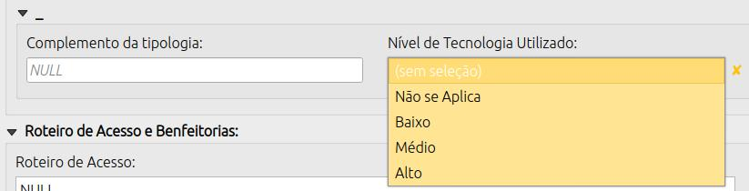{#fig-complemento-nivel-tecnologia}

::: {.callout-note title=@fig-complemento-nivel-tecnologia}

*Complemento da Tipologia*: campo de texto para complementar a descrição da tipologia do imóvel em nível regional;  
*Nível de Tecnologia Utilizado*: indica o nível de tecnologia utilizado nas atividades produtivas do imóvel. As opções de resposta são:  
    - `Não se aplica`  
    - `Baixo`  
    - `Médio`  
    - `Alto`  

:::

**Roteiro de Acesso e Benfeitorias**

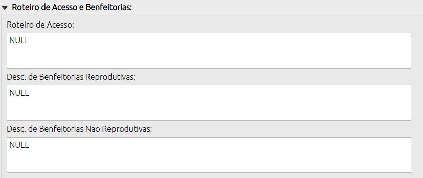{#fig-roteiro-benfeitoria}

::: {.callout-note title=@fig-roteiro-benfeitoria}

*Roteiro de Acesso*: campo de texto para descrever o roteiro de acesso ao imóvel;  
*Benfeitorias Não Reprodutivas*: obras, melhorias ou construções aderidas ao solo que não geram renda direta (receita agrícola/pecuária). Elas adicionam valor ao imóvel rústico ou urbano pela funcionalidade, como moradias, galpões, estradas, cercas, sistemas de drenagem e irrigação.  
*Benfeitorias Reprodutivas*: melhorias aplicadas a um imóvel rural que geram renda e possuem valor econômico direto. Exemplos comuns incluem culturas agrícolas (temporárias e perenes), pastagens cultivadas ou nativas melhoradas, e florestas plantadas.
:::

**Forma de Pagamento**

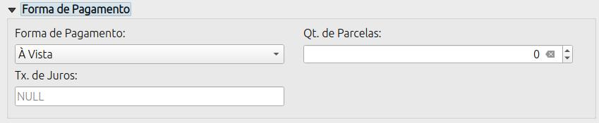{#fig-pgto}

::: {.callout-note title=@fig-pgto}

*Forma de Pagamento*:  
- `À vista`: pagamento integral no momento da transação;  
- `À Prazo`: pagamento dividido em parcelas ao longo do tempo;  
*Qt. de Parcelas*: para o caso de pagamento à prazo, informe a quantidade de parcelas;  
*Tx. de juros*: taxa de juros a ser aplicada para cálculo do valor presente líquido (VPL) para o caso de pagamento à prazo.  
:::

**Valores do Elemento**

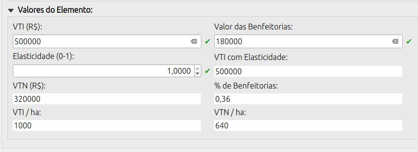{#fig-valores}

::: {.callout-note title=@fig-valores}

*VTI (R\$)*: Valor Total do Imóvel, ou seja, o valor total da transação ou oferta;  
*Valor das Benfeitorias*: valor total das benfeitorias do imóvel;  
*Elasticidade*: para ofertas representa o percentual do preço ofertado pelo qual, provavelmente, o negócio será fechado. O campo aceita valores entre 0 e 1;  
*VTI com Elasticidade*: valor total do imóvel considerando a elasticidade;  
*VTN (R\$)*: Valor da Terra Nua, ou seja, o valor do imóvel sem as benfeitorias;  
*% de Benfeitorias*: percentual das benfeitorias em relação ao VTI;  
*VTI/ha*: valor total do imóvel por hectare;  
*VTN/ha*: valor da terra nua por hectare.  
:::

### Aba: Pessoas

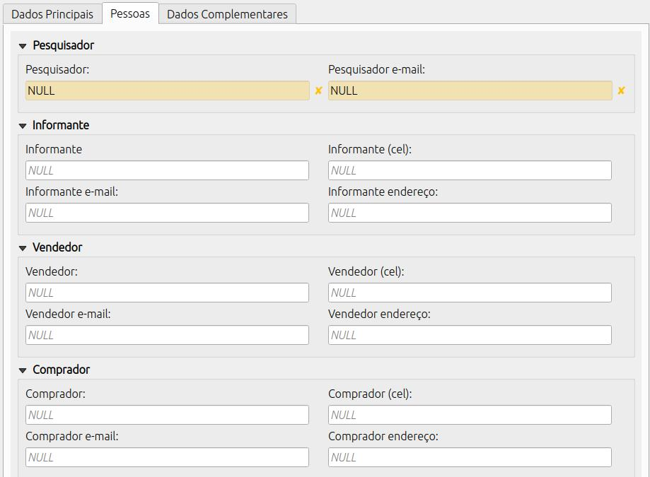{#fig-pessoas}

Nessa aba se concentra os contatos das pessoas envolvidas na pesquisa ou na transação.  

::: {.callout-note title=@fig-pessoas}

**Pesquisador**  

- *Pesquisador*: técnico responsável pela coleta do elemento;
- *Pesquisador e-mail*: e-mail do técnico responsável pela coleta do elemento;

**Informante**

- *Informante*: nome da pessoa que forneceu as informações do elemento;
- *Informante (cel)*: celular da pessoa que forneceu as informações do elemento;
- *Informante e-mail*: e-mail da pessoa que forneceu as informações do elemento;
- *Informante endereço*: endereço da pessoa que forneceu as informações do elemento;  

**Vendedor**

- *Vendedor*: nome da pessoa que vendeu;
- *Vendedor (cel)*: celular da pessoa que vendeu;
- *Vendedor e-mail*: e-mail da pessoa que vendeu;
- *Vendedor endereço*: endereço da pessoa que vendeu;

**Comprador**

- *Comprador*: nome da pessoa que comprou;
- *Comprador (cel)*: celular da pessoa que comprou;
- *Comprador e-mail*: e-mail da pessoa que comprou;
- *Comprador endereço*: endereço da pessoa que comprou;

:::

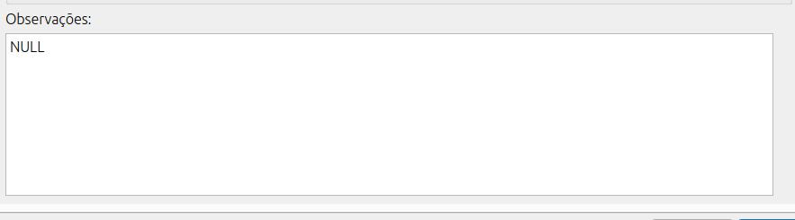{#fig-observacoes}

::: {.callout-note title=@fig-observacoes}

Campo de texto que pode ser utilizado livremente para descrever qualquer característica do elementos que não foi contempladas pelo campor do formulário.

:::

### Aba: Dados complementares

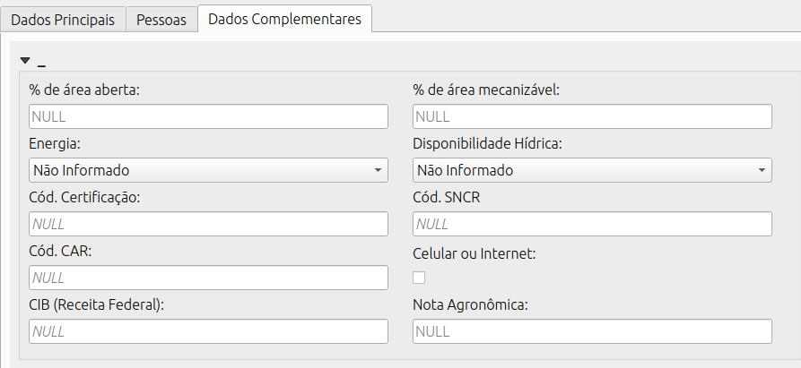{#fig-dados-complementares}

::: {.callout-note title=@fig-dados-complementares}

*% de área aberta*: quanto do imóvel já foi desmatado ou aberto para agricultura e/ou pecuária;  
*% de área mecanizável*: quanto do imóvel é mecanizável devido a limitações como o relevo, a presença de corpos d'água, etc; 
*Cód. Certificação*: caso o imóvel seja certificado, informe o código SIGEF ou SNCI;  
*Código SNCR*: informar o código no Sistema Nacional de Cadastro Rural (SNCR);  
*Cód. CAR*: informar o código do imóvel no Cadastro Ambiental Rural (CAR);
*CIB (Receita Federal)*: informar o código do imóvel no Cadastro Imobiliario Brasileiro (CIB) da Receita Federal;  
*Celular ou internet*: marque a ceixa caso haja um desses dois itens;
*Nota Agronômica*: caso calcule a nota agronômica do elemento, informe o valor aqui;

:::

::: {layout-ncol="2"}

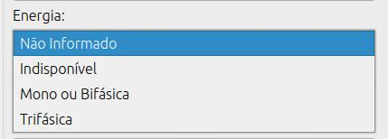{#fig-energia}

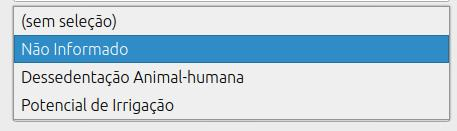{#fig-disp-hidrica}

::: {.callout-note title=@fig-energia}

Informe se o imóvel possui energia elétrica:   
- `Não informado`
- `Indisponível`: imóvel sem energia elétrica;
- `Mono ou Bifásica`: imóvel com energia elétrica disponível, mas com limitação de carga;  
- `Trifásica`: imóvel com energia elétrica disponível sem limitação de carga.

:::

::: {.callout-note title=@fig-disp-hidrica}

Informe quanto a disponibilidade de recursos hídricos no imóvel.  
- `Não informado`  
- `Dessedentação Animal-humana`: o imóvel possui água, porém sem podetncial de irrigação;  
- `Potencial de irrigação`: recursos que viabilizam a implantação de sistema de irrigação.

:::
:::

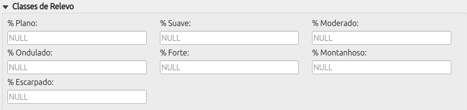{#fig-relevo}

Informe as classes de relevo do imóvel de acordo com a tabela do Manual de Obtenção de Terras do INCRA.

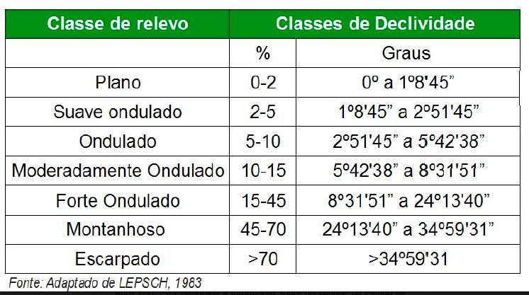

::: {.callout-warning title="Aviso"}

O formulário ainda não possui validador da soma das classes, por isso, confira os dados digitados.
:::

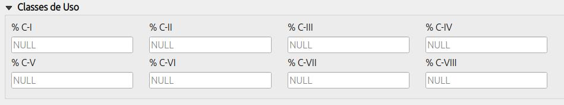{#fig-uso}

Informe as classes de capacidade de uso do solo do imóvel de acordo com a tabela do Manual de Obtenção de Terras do INCRA.

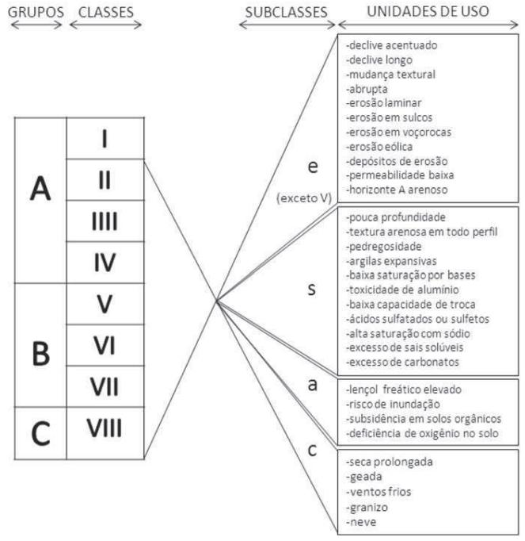

::: {.callout-warning title="Aviso"}

O formulário ainda não possui validador da soma das classes, por isso, confira os dados digitados.
:::

## Finalizando e salvando

Após finalizar o preenchimento das informações sobre o elementos pesquisado, clique no botão **ok** do formulário.

::: {layout-ncol="2"}

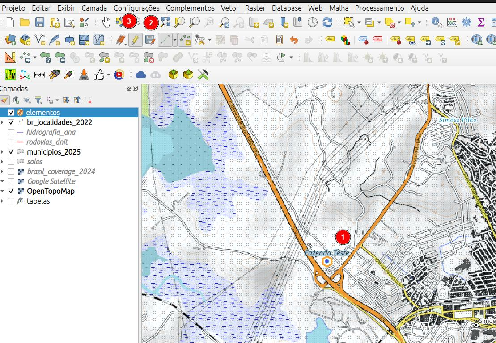{#fig-salvando}

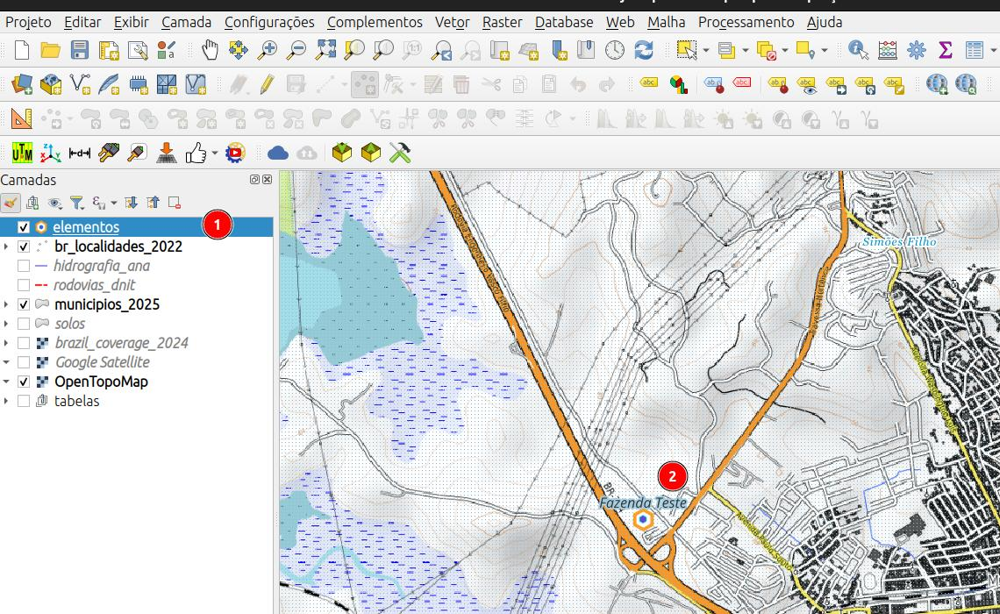{#fig-elemento}

::: {.callout-note title=@fig-salvando}

1. Elemento criado;  
2. Botão de salvar camada;  
3. DEsabilite a edição da camada caso não haja mais elementos a serem informados.
:::

::: {.callout-note title=@fig-elemento}

1. Camada salva e com a edição desabilitada;     
2. elemento inserido;
:::

:::

:::