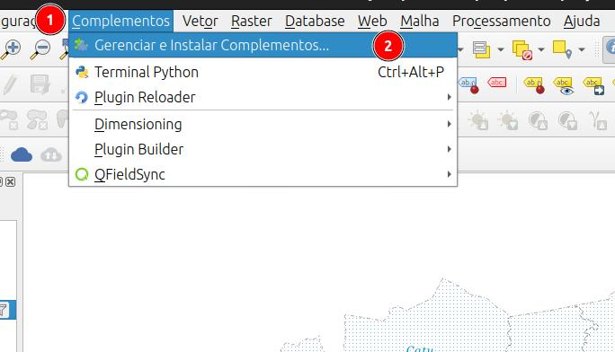
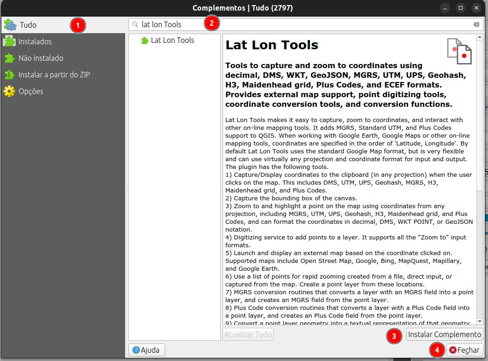

::: {#cap11b .section}
# QGIS: Informar coordenada de localização de elementos de preços manualmente.

Muitas vezes precisamos digitar as coordenadas de localização de um elemento pesquisado no QGIS, para isso, podemos utilizar um dos métodos descritos abaixo:

## Editando a localização de um ponto da camada `elementos`

## Usando o plugin [`Lat Lon Tools`](https://github.com/hamiltoncj/qgis-latlontools-plugin/#readme)

**Instalação do plugin**  

::: {layout-ncol="2"}

:::

::: {.callout-note}

::: {.callout-note title="Gerenciar e Instalar Complementos"}

1. Acesse o menu **Complementos**
2. Selecione **Gerenciar e Instalar Complementos**
:::

::: {.callout-note title="Instalando o plugin"}

1. Clique em **Todos** para acessar a lista completa de plugins disponíveis;
2. Digite **Lat Lon Tools** na barra de pesquisa para encontrar o plugin;
3. Selecione o plugin **Lat Lon Tools** na lista de resultados;
4. Clique em **Instalar Complemento** para instalar o plugin.
:::

:::

O ***Lat Lon Tools*** facilita a captura, o zoom para coordenadas, a conversão de coordenadas em campos de texto para novas camadas de pontos, a exportação da geometria de pontos para campos de texto e a interação com outras ferramentas de mapeamento online. Ele adiciona suporte a coordenadas MGRS, UTM padrão, UPS, Geohash, GEOREF, Plus Code (Open Location Code), WKT, EWKT, JSON e ECEF ao QGIS. Ao trabalhar com o **Google Earth**, **Google Maps** ou outras ferramentas de mapeamento online, as coordenadas são especificadas na ordem 'Latitude, Longitude'. Por padrão, o ***Lat Lon Tools*** usa o formato padrão do Google Maps, mas é muito flexível e pode usar praticamente qualquer projeção e formato de coordenadas para entrada e saída. As seguintes ferramentas estão disponíveis no ***Lat Lon Tools***.

*  ***Zoom para Coordenada*** - Com esta ferramenta, digite ou cole uma coordenada na área de texto e pressione **Enter**. O QGIS centraliza o mapa na coordenada, destaca e cria um marcador temporário no local. Para formatos que representam uma região em vez de um ponto, como **Geohash**, **H3**, **Maindenhead** e **Códigos Plus (Open Location Code)**, a área da região é exibida juntamente com o ponto central. Se o sistema de coordenadas padrão **WGS 84** (EPSG:4326 - latitude/longitude) for especificado, ***Zoom para Coordenada*** pode interpretar coordenadas em **graus decimais**, **DMS**, **WKT POINT**, **UTM padrão**, **UPS**, **MGRS**, **GEOREF**, **Códigos Plus (Open Location Code)** ou **GeoJSON**. Também é possível ampliar para coordenadas **Geohash**, coordenadas de grade **Maidenhead** de rádio amador, coordenadas **H3** Geohash (se a biblioteca H3 versão 4.xx estiver instalada) ou qualquer outra projeção, quando configurada em **Configurações** ou pelo botão **Selecionar Modo CRS**. A ***Ordem das Coordenadas*** em ***Configurações*** ou o botão **Alternar Ordem das Coordenadas** abaixo define se a ordem é latitude seguida de longitude (Y,X) ou longitude seguida de latitude (X,Y). As seguintes ações também podem ser realizadas na caixa de diálogo ***Ampliar para***:
    *  Ao pressionar este botão, o QGIS amplia a visualização para o local.
    *  Isso cola o conteúdo da área de transferência na área de texto.
    *  O marcador é removido com este botão.
    *  Isso alterna a ordem das coordenadas sem precisar acessar as **Configurações**.
    *  Isso especifica o tipo de coordenada que deve ser interpretada sem precisar acessar as **Configurações**.
    *  O comportamento e os tipos de coordenadas interpretados podem ser configurados pressionando o botão **Configurações**.  

    
::: {.callout-important}
As explicações acima foram traduzidas da página do desenvolvedor do plugin [Lat Lon Tools](https://github.com/hamiltoncj/qgis-latlontools-plugin/tree/main) o [Sr. Calvin Hamilton](https://github.com/hamiltoncj)
:::
