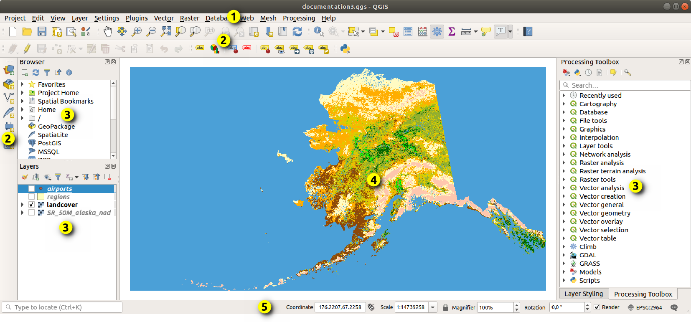

::: {#cap4 .section}
# Introdução ao QGIS: Interface e Primeiro Projeto

::: {.callout-important}
Este manual possui citações e partes baseadas do [Manual do QGIS](https://docs.qgis.org/3.44/pt_BR/docs/user_manual/introduction/getting_started.html) e de tutoriais oficiais do QGIS, adaptados para um formato de apostila. 
:::
::: {#introducao-cap4 .section}
## Introdução

O **QGIS** é um software de Sistema de Informações Geográficas (SIG)
gratuito e de código aberto, amplamente utilizado em projetos de
geoprocessamento no mundo todo. \[web:32\]\[web:35\]

Neste capítulo, vamos conhecer a interface básica do QGIS e realizar um
primeiro projeto simples: criar um projeto, adicionar camadas vetoriais
e raster e salvar o trabalho. \[web:32\]\[web:33\]\[web:36\]

<!-- ::: {.callout-note}
\[IMAGEM 1: Captura de tela geral da interface do QGIS aberta, com
destaque visual para as principais áreas: barras de menus, barras de
ferramentas, painel de camadas e área de mapa.\]
::: -->
:::

::: {#interface-basica .section}
## Conhecendo a [Interface do QGIS](https://docs.qgis.org/3.44/pt_BR/docs/user_manual/introduction/qgis_gui.html#qgis-gui) 

Ao abrir o QGIS, a tela inicial é composta por diferentes partes, cada
uma com uma função específica. \[web:32\]\[web:33\]

::: {.callout-note}
-  **1-Barra de menus** (topo): onde ficam os menus "Projeto", "Camada",
    "Configurações", "Plugins", etc.
-   **2-Barras de ferramentas**: conjuntos de ícones que permitem acesso
    rápido às principais funções (zoom, seleção, adicionar camada,
    etc.).
-   **3-Painel de camadas** (geralmente à esquerda): lista todas as
    camadas do projeto, permitindo ligá-las, desligá-las e organizar a
    ordem.
-   **4-Área de mapa**: onde os dados geográficos são visualizados.
-   **5-Barra de status** (parte inferior): mostra informações como o SRC
    do projeto e a coordenada do ponteiro do mouse. \[web:33\]
:::
:::

::: {#criando-projeto .section}
## Criando um Novo Projeto

O primeiro passo para trabalhar no QGIS é criar um projeto, que irá
guardar a organização de camadas, SRC e configurações de visualização.
\[web:35\]\[web:36\]

### Passo a passo

::: {.callout-note}
1.  Abrir o QGIS.
2.  No menu superior, clicar em **"Projeto"** \> **"Novo"** para iniciar
    um projeto em branco. \[web:36\]
3.  Opcionalmente, salvar o projeto logo no início: em "Projeto" \>
    "Salvar Como\...", escolher uma pasta e um nome (por exemplo,
    *projeto_introducao.qgz*).
4.  Verificar, na barra de status (canto inferior direito), qual é o SRC
    atual do projeto (por exemplo, "EPSG:4326").
:::
:::

::: {#src-projeto .section}
## Ajustando o Sistema de Referência de Coordenadas (SRC) do Projeto

Configurar corretamente o SRC do projeto é essencial para que as camadas
sejam exibidas na posição correta. \[web:37\]\[web:39\]

### Definindo o SRC do Projeto

::: {.callout-note}
1.  Na barra de status, clique sobre o código EPSG exibido (por exemplo,
    "EPSG:4326"). \[web:39\]
2.  Será aberta a janela de configurações do SRC do projeto.
3.  Na lista, procurar e selecionar o sistema desejado (por exemplo,
    "SIRGAS 2000 / UTM zone 23S -- EPSG:31983", se apropriado à área de
    estudo). \[web:37\]\[web:41\]
4.  Clicar em **"OK"** para aplicar a configuração.
:::
:::

::: {#adicionar-vetorial .section}
## Adicionando uma Camada Vetorial

Uma das tarefas mais comuns no QGIS é carregar arquivos vetoriais (como
shapefiles ou geopackages) para visualização e análise.
\[web:36\]\[web:38\]\[web:44\]

### Passo a passo para adicionar vetores

::: {.callout-note}
1.  Com o projeto aberto, acessar o menu **"Camada"** \> **"Adicionar
    Camada"** \> **"Adicionar Camada Vetorial\..."**.
    \[web:36\]\[web:44\]
2.  Na janela que abrir, clicar em **"Explorar"** ou "Procurar" para
    localizar o arquivo (por exemplo, um shapefile de limites
    municipais).
3.  Selecionar o arquivo desejado (ex.: *municipios.shp*) e clicar em
    **"Abrir"**.
4.  Conferir o SRC da camada (caso o QGIS pergunte) e confirmar.
5.  Clicar em **"Adicionar"**. A camada aparecerá no painel de camadas e
    será exibida na área de mapa. \[web:36\]
:::
:::

::: {#adicionar-raster .section}
## Adicionando uma Camada Raster

Além de vetores, o QGIS permite carregar facilmente dados raster, como
imagens de satélite ou modelos de elevação.
\[web:36\]\[web:38\]\[web:45\]

### 4.5.1. Passo a passo para adicionar raster

::: {.callout-note}
1.  No menu superior, clicar em **"Camada"** \> **"Adicionar Camada"**
    \> **"Adicionar Camada Raster\..."**. \[web:36\]
2.  Clicar em **"Explorar"** para localizar o arquivo raster (por
    exemplo, um GeoTIFF de relevo).
3.  Selecionar o arquivo desejado e clicar em **"Abrir"**.
4.  Conferir as informações do SRC, se solicitado, e confirmar.
5.  Clicar em **"Adicionar"**. A camada raster será exibida no mapa,
    geralmente abaixo das camadas vetoriais. \[web:36\]\[web:38\]
:::
:::

::: {#navegacao-visualizacao .section}
## Navegação e Visualização Básica

Depois de adicionar as camadas, é importante saber navegar pelo mapa e
ajustar o modo de visualização. \[web:32\]\[web:33\]

::: {.callout-note}
-   **Zoom in / Zoom out**: usar a roda do mouse ou os ícones de lupa na
    barra de ferramentas.
-   **Deslocar mapa (pan)**: usar a ferramenta de "mão" para arrastar o
    mapa.
-   **Zoom para a extensão da camada**: clicar com o botão direito na
    camada no painel de camadas e escolher "Zoom para a camada".
-   **Ligar/desligar camadas**: marcar ou desmarcar a caixa ao lado do
    nome da camada no painel de camadas.
:::
:::

::: {#salvar-projeto .section}
## Salvando o Projeto

O projeto QGIS guarda apenas as referências às camadas (caminho dos
arquivos, SRC, estilo de visualização), e não uma cópia dos dados. Por
isso, é importante organizar seus arquivos em pastas e salvar o projeto
regularmente. \[web:35\]

### Passo a passo para salvar

::: {.callout-note}
1.  No menu superior, clicar em **"Projeto"** \> **"Salvar"** ou "Salvar
    Como\...".
2.  Escolher uma pasta organizada para seu trabalho (por exemplo, uma
    pasta com subpastas "vetor", "raster", "projeto").
3.  Definir um nome significativo para o arquivo de projeto (ex.:
    *exemplo_cap4.qgz*).
4.  Clicar em **"Salvar"**.
:::
:::

::: {#roteiro-resumido-cap4 .section}
## Roteiro Resumido: Primeiro Projeto no QGIS

Para recapitular, veja um roteiro simples que pode ser seguido por um
iniciante para criar seu primeiro projeto no QGIS. \[web:36\]\[web:38\]

::: {.callout-note}
1.  Abrir o QGIS e criar um novo projeto.
2.  Ajustar o SRC do projeto conforme a área de estudo (por exemplo,
    SIRGAS 2000 / UTM fuso adequado).
3.  Adicionar uma camada vetorial (shapefile ou geopackage) com os
    limites da área de estudo.
4.  Adicionar uma camada raster (imagem de satélite ou MDE) para servir
    de base visual.
5.  Ajustar a ordem das camadas e praticar zoom, pan e visualização.
6.  Salvar o projeto em uma pasta organizada.
:::
:::
:::